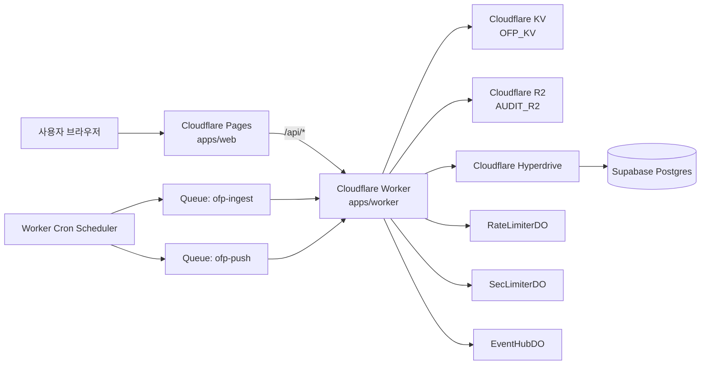
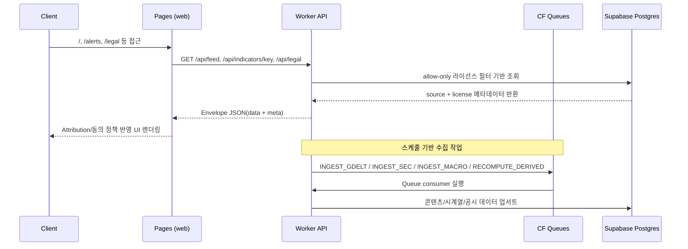
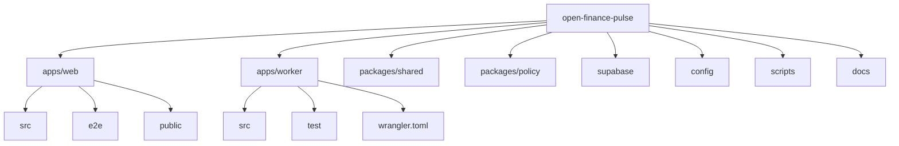

# Open Finance Pulse

[English](./README.md) | [한국어](./README.ko.md)

데이터 소스 라이선스 준수, 광고 동의 정책, 배포 게이트 검증을 명시적으로 내장한 Cloudflare 기반 금융 인텔리전스 플랫폼입니다.
link : financeaxiom.com


## 목차

1. [프로젝트 개요](#1-프로젝트-개요)
2. [핵심 기능](#2-핵심-기능)
3. [시스템 아키텍처](#3-시스템-아키텍처)
4. [저장소 구조](#4-저장소-구조)
5. [API 구성](#5-api-구성)
6. [컴플라이언스 및 보안 통제](#6-컴플라이언스-및-보안-통제)
7. [품질 게이트 및 테스트 전략](#7-품질-게이트-및-테스트-전략)
8. [로컬 개발 가이드](#8-로컬-개발-가이드)
9. [환경 변수 구성](#9-환경-변수-구성)
10. [배포 플레이북](#10-배포-플레이북)
11. [운영 문서 인덱스](#11-운영-문서-인덱스)
12. [현재 제약사항](#12-현재-제약사항)
13. [라이선스](#13-라이선스)

## 1. 프로젝트 개요

Open Finance Pulse는 다음을 결합한 모노레포입니다.

- Cloudflare Pages에 배포되는 React/Vite 프론트엔드 (`apps/web`)
- `/api/*`를 제공하는 Cloudflare Worker 백엔드 (`apps/worker`)
- 계약/타입 및 정책 게이트 패키지 (`packages/shared`, `packages/policy`)
- Hyperdrive를 통한 Supabase/Postgres 영속 저장
- `docs/` 기반 감사/법무/운영 문서 체계

프로젝트의 운영 지향 포인트:

- 릴리즈 게이트 자동화 (`test:release-gate`, `test:oss-notice-gate`, `test:cmp-deploy`)
- 데이터 소스 라이선스 및 저작권 정책 기반 노출 제어
- 보안 통제(레이트 리밋, 인증 게이트웨이 하드닝, 푸시 데이터 암호화)

## 2. 핵심 기능

- 다중 탭 마켓 피드 (`breaking`, `filings`, `macro`, `newsindex`)
- 엔티티/시계열 상세 조회 API
- SEC 공시 및 거시지표/파생지표 수집 파이프라인
- Supabase Auth 연계 로그인/회원가입/비밀번호 재설정/변경
- 알림 규칙 및 푸시 구독 관리
- 지역별 광고 동의 정책 + CMP 신호(TCF/GPP/USP) 연동
- Legal/Privacy/Terms 화면 및 API 기반 법무 메타데이터 제공

## 3. 시스템 아키텍처

### 3.1 런타임 토폴로지



### 3.2 데이터/제어 흐름



## 4. 저장소 구조

### 4.1 구조 다이어그램



### 4.2 디렉터리 책임

| 경로 | 역할 |
|---|---|
| `apps/web` | 프론트엔드, 라우팅, 동의 UI, E2E 테스트, Pages 정적 자산 |
| `apps/worker` | API 라우터, 수집 잡, 큐 컨슈머, 레이트리미터, 인증 게이트웨이 |
| `packages/shared` | 공통 payload 타입/응답 유틸 |
| `packages/policy` | 정책 게이트(FRED 차단, 메타데이터-only 제한 등) |
| `supabase` | 마이그레이션/시드 SQL |
| `config` | 소스/라이선스/지표 메타 설정 |
| `scripts` | 릴리즈 게이트/컴플라이언스/배포 스모크 스크립트 |
| `docs` | 감사로그, 법무 문서, 운영 핸드오프 문서 |

## 5. API 구성

### 5.1 공개 API

| 메서드 | 경로 | 설명 |
|---|---|---|
| `GET` | `/api/feed` | 탭/검색/지역 기반 피드 + 커서 페이지네이션 |
| `GET` | `/api/indicators/key` | 핵심 지표 카드 + 스파크라인 데이터 |
| `GET` | `/api/legal` | 소스/라이선스/법적 안내 payload |
| `GET` | `/api/geo` | 지역 정책 분류(`EU_UK_CH`, `US_STATE_PRIVACY`, `NON_EU`) |
| `GET` | `/api/entity/:slug` | 엔티티 관련 피드(허용 라이선스만 노출) |
| `GET` | `/api/series/:id` | 시계열 raw/derived 조회(허용 라이선스만 노출) |
| `GET` | `/api/f/:accession` | 공시 데이터 조회 |

### 5.2 인증 필요 API

| 메서드 | 경로 | 설명 |
|---|---|---|
| `GET`,`POST` | `/api/account/audit` | 사용자 계정 활동 감사 로그 |
| `GET`,`POST` | `/api/alerts/rules` | 알림 규칙 조회/저장 |
| `POST` | `/api/push/subscribe` | 푸시 구독 저장(암호화 저장) |
| `POST` | `/api/push/unsubscribe` | 푸시 구독 제거 |
| `GET` | `/api/stream` | 인증 기반 실시간 이벤트 스트림 |

### 5.3 인증 게이트웨이 API

| 메서드 | 경로 | 설명 |
|---|---|---|
| `POST` | `/api/auth/login` | 로그인 프록시 |
| `POST` | `/api/auth/signup` | 회원가입 프록시(redirect allowlist 적용) |
| `POST` | `/api/auth/password-reset` | 비밀번호 재설정 요청 |
| `POST` | `/api/auth/password-change` | 비밀번호 변경 |
| `POST` | `/api/auth/logout` | 로그아웃 |

## 6. 컴플라이언스 및 보안 통제

| 통제 영역 | 구현 내용 |
|---|---|
| 라이선스 노출 정책 | feed/entity/series API에서 허용 라이선스만 반환 |
| 퍼블리셔 콘텐츠 제한 | 기사 본문/원문 헤드라인/이미지 필드 차단(메타데이터-only) |
| 소스별 제약 정책 | FRED 하드블록, Eurostat 지역 필터, OECD/WB 제한 게이트 |
| Attribution 표기 | UI에서 `license.attribution_text` 노출 |
| 공개 API 남용 방지 | 스코프별 레이트리밋 + DO 기반 제어 |
| SEC 공정접근 준수 | User-Agent 선언 + 요청 속도 제한 |
| 인증 하드닝 | 본문 크기 제한, redirect 검증, 서킷브레이커/재시도 정책 |
| 푸시 개인정보 보호 | endpoint/keys AES-GCM 암호화 저장 |
| 광고 동의 정책 | TCF/GPP/USP 신호 확인 후 광고 스크립트 로드 |
| OSS 고지 체계 | `THIRD_PARTY_NOTICES.txt` 생성 + lockfile 동기화 게이트 |

## 7. 품질 게이트 및 테스트 전략

| 명령어 | 목적 |
|---|---|
| `npm run typecheck` | 전체 워크스페이스 타입 정합성 |
| `npm run test:unit` | 정책/워커 단위 테스트 |
| `npm run test:integration` | 워커 라우트 통합 테스트 |
| `npm run test:compliance` | 스펙/법무 정책 준수 테스트 |
| `npm run test:e2e` | 프론트 사용자 플로우 + 동의 시나리오 검증 |
| `npm run test:release-gate` | 릴리즈 핵심 정책 게이트 + OSS 노티스 게이트 |
| `npm run test:cmp-deploy` | 실배포 CMP 마커/광고 메타 파일 스모크 검증 |
| `npm run gen:oss-notices` | lockfile 기반 `THIRD_PARTY_NOTICES.txt` 재생성 |

## 8. 로컬 개발 가이드

### 8.1 사전 요구사항

- Node.js 22+
- npm 10+
- Cloudflare Wrangler CLI (`npx wrangler ...`)
- Supabase 로컬 스택(전체 DB 플로우 검증 시)

### 8.2 부트스트랩

```bash
npm install
npm run typecheck
npm run build
```

### 8.3 서비스 실행

```bash
# Worker 로컬 실행
npm run -w apps/worker dev

# Web 로컬 실행
npm run -w apps/web dev -- --host 127.0.0.1 --port 4173
```

### 8.4 DB 자산

- 마이그레이션: `supabase/migrations/`
- 시드 데이터: `supabase/seed.sql`
- 보조 명령:
  - `npm run db:migrate`
  - `npm run db:seed`

## 9. 환경 변수 구성

### 9.1 Web (`apps/web/.env.local.example`)

| 변수 | 설명 |
|---|---|
| `VITE_SUPABASE_URL` | 프론트 인증 SDK용 Supabase URL |
| `VITE_SUPABASE_ANON_KEY` | 프론트 공개 anon 키 |
| `VITE_API_BASE_URL` | API 베이스 URL 오버라이드 |
| `VITE_VAPID_PUBLIC_KEY` | 푸시 공개키 |
| `VITE_AD_CLIENT_ID` | 광고 클라이언트 식별자 |

### 9.2 Worker (`apps/worker/.dev.vars.example`)

| 변수 | 설명 |
|---|---|
| `SUPABASE_URL` / `SUPABASE_ANON_KEY` / `SUPABASE_JWKS_URL` | 인증 연동 |
| `DATABASE_URL` | Postgres 연결 문자열 |
| `SEC_USER_AGENT` | SEC 접근 정책용 UA |
| `PUSH_DATA_ENC_KEY` | 푸시 데이터 암호화 키 |
| `EVENT_HUB_INTERNAL_TOKEN` | 내부 이벤트 허브 토큰 |
| `VAPID_PUBLIC_KEY` / `VAPID_PRIVATE_KEY` / `VAPID_SUBJECT` | 푸시 자격정보 |
| `ALLOWED_ORIGINS` / `AUTH_ALLOWED_REDIRECT_ORIGINS` | CORS 및 redirect allowlist |

보안 주의: 실제 비밀값은 절대 커밋하지 마세요. `.gitignore`는 `.env*`, `.dev.vars*`, `.wrangler/`, 인증서/키 패턴을 차단하도록 설정되어 있습니다.

## 10. 배포 플레이북

### 10.1 Web (Cloudflare Pages)

```bash
npm run -w apps/web build
npx wrangler pages deploy apps/web/dist --project-name open-finance-pulse --branch main
```

### 10.2 Worker (Cloudflare Workers)

```bash
npx wrangler deploy --config apps/worker/wrangler.toml
```

### 10.3 배포 후 검증

```bash
npm run test:release-gate
npm run test:cmp-deploy
```

권장 운영 스모크 체크:

- `https://financeaxiom.com`
- `https://api.financeaxiom.com/api/feed?tab=breaking`
- `https://api.financeaxiom.com/api/indicators/key`
- `https://api.financeaxiom.com/api/legal`

## 11. 운영 문서 인덱스

| 문서 | 용도 |
|---|---|
| `SPEC.md` | 제품/컴플라이언스 기준 스펙 |
| `docs/HANDOFF.md` | 운영 핸드오프 및 재진입 가이드 |
| `docs/LEGAL_AUDIT_2026-02-20.md` | 법무/컴플라이언스 감사 로그 및 조치 상태 |
| `docs/OSS_NOTICES_PROCESS.md` | OSS 고지 생성/검증 절차 |
| `docs/LEGAL_NOTICES.md` | 데이터 소스 정책 링크 집합 |
| `docs/PRIVACY.md`, `docs/TERMS.md` | 외부 공개 정책 문안 |

## 12. 현재 제약사항

- `apps/web/public/ads.txt`, `apps/web/public/sellers.json`는 광고 상용화 준비용 기본 파일입니다. 실제 광고 운영 전 판매자 메타데이터를 반영해야 합니다.
- 인증된 CMP 동작은 외부 런타임 의존성이므로 배포마다 `npm run test:cmp-deploy`로 검증해야 합니다.
- 일부 문서는 날짜 기반 감사 스냅샷이므로 외부 보고 전 최신 배포 상태와 함께 교차 검증이 필요합니다.

## 13. 라이선스

Apache License 2.0 (`LICENSE`)를 따릅니다.
