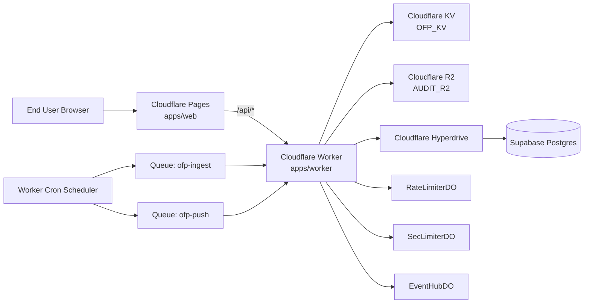
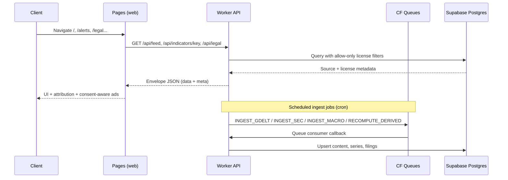
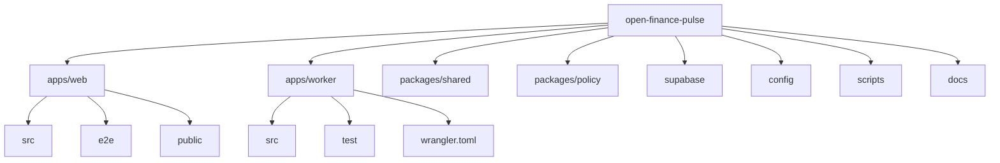

# Open Finance Pulse

[English](./README.md) | [한국어](./README.ko.md)

Financial intelligence platform built on a Cloudflare-first architecture, with explicit legal/compliance controls for data-source usage, ad-consent gating, and release-time audit checks.

## Table of Contents

1. [Executive Summary](#1-executive-summary)
2. [Key Capabilities](#2-key-capabilities)
3. [System Architecture](#3-system-architecture)
4. [Repository Layout](#4-repository-layout)
5. [API Surface](#5-api-surface)
6. [Compliance and Security Controls](#6-compliance-and-security-controls)
7. [Quality Gates and Test Strategy](#7-quality-gates-and-test-strategy)
8. [Local Development](#8-local-development)
9. [Environment Configuration](#9-environment-configuration)
10. [Deployment Playbook](#10-deployment-playbook)
11. [Operational Documentation](#11-operational-documentation)
12. [Known Constraints](#12-known-constraints)
13. [License](#13-license)

## 1. Executive Summary

Open Finance Pulse is a monorepo that combines:

- A React/Vite frontend (`apps/web`) deployed to Cloudflare Pages
- A Cloudflare Worker backend (`apps/worker`) serving `/api/*` routes
- Shared contract/type and policy packages (`packages/shared`, `packages/policy`)
- Supabase/Postgres data persistence via Hyperdrive
- Compliance artifacts and operational audits in `docs/`

The project emphasizes:

- Deterministic release gates (`test:release-gate`, `test:oss-notice-gate`, `test:cmp-deploy`)
- Source-license and attribution-aware data exposure
- Security controls (rate limiting, auth gateway hardening, encrypted push subscription storage)

## 2. Key Capabilities

- Multi-tab market feed (`breaking`, `filings`, `macro`, `newsindex`)
- Entity and series drilldown APIs
- SEC filing retrieval and macro/derived series ingestion
- Auth flows (signup/login/reset/change/logout) through Supabase Auth gateway
- Alert rules and push subscription management
- Region-aware ad-consent enforcement with CMP signal bridging (`TCF/GPP/USP`)
- Legal notice, privacy, and terms surfaces backed by API + docs

## 3. System Architecture

### 3.1 Runtime Topology



### 3.2 Data and Control Flow



## 4. Repository Layout

### 4.1 Structure Diagram



### 4.2 Directory Responsibilities

| Path | Responsibility |
|---|---|
| `apps/web` | React app, routing, consent UI, e2e tests, Pages static assets |
| `apps/worker` | API router, ingestion jobs, queue consumers, rate limiting, auth gateway |
| `packages/shared` | Shared payload types and envelope helpers |
| `packages/policy` | License/compliance gates (FRED block, metadata-only restrictions, etc.) |
| `supabase` | SQL migrations and seed data |
| `config` | Source, license, and indicator metadata |
| `scripts` | Release/compliance/deploy smoke scripts |
| `docs` | Audit logs, legal notices, privacy/terms, handoff and verification docs |

## 5. API Surface

### 5.1 Public Endpoints

| Method | Path | Purpose |
|---|---|---|
| `GET` | `/api/feed` | Feed by tab/query/region with cursor pagination |
| `GET` | `/api/indicators/key` | Key indicator cards and sparkline payloads |
| `GET` | `/api/legal` | Source/license statements and legal payload |
| `GET` | `/api/geo` | Region policy classification (`EU_UK_CH`, `US_STATE_PRIVACY`, `NON_EU`) |
| `GET` | `/api/entity/:slug` | Entity-related feed items (allowed-license only) |
| `GET` | `/api/series/:id` | Raw/derived series data (allowed-license only) |
| `GET` | `/api/f/:accession` | Filing lookup |

### 5.2 Authenticated Endpoints

| Method | Path | Purpose |
|---|---|---|
| `GET`,`POST` | `/api/account/audit` | User account activity audit trail |
| `GET`,`POST` | `/api/alerts/rules` | Alert rule management |
| `POST` | `/api/push/subscribe` | Push subscription upsert (encrypted at rest) |
| `POST` | `/api/push/unsubscribe` | Push subscription removal |
| `GET` | `/api/stream` | Authenticated event stream |

### 5.3 Auth Gateway Endpoints

| Method | Path | Purpose |
|---|---|---|
| `POST` | `/api/auth/login` | Login proxy with guardrails |
| `POST` | `/api/auth/signup` | Signup proxy with redirect validation |
| `POST` | `/api/auth/password-reset` | Password reset request |
| `POST` | `/api/auth/password-change` | Password change |
| `POST` | `/api/auth/logout` | Logout |

## 6. Compliance and Security Controls

| Control Area | Implementation |
|---|---|
| License exposure policy | Feed/entity/series APIs enforce allow-only commercial status |
| Metadata-only publisher handling | Policy gates prevent publisher body/headline/image ingestion |
| Source-specific restrictions | FRED hard block, Eurostat geo filter, OECD/WB restricted gating |
| Attribution visibility | UI surfaces include `license.attribution_text` where required |
| Public route abuse controls | Per-scope rate limiting via `RateLimiterDO` |
| SEC fair-access | Declared user-agent and request rate limiting (`SecLimiterDO`) |
| Auth hardening | Input size limits, redirect allowlist, retry/circuit-breaker behaviors |
| Push privacy | Subscription endpoint/keys encrypted with AES-GCM before storage |
| Consent compliance | EU/US-state signal checks with TCF/GPP/USP bridge before ad script load |
| OSS license readiness | Generated `THIRD_PARTY_NOTICES.txt` + stale-lockfile gate |

## 7. Quality Gates and Test Strategy

| Command | Scope |
|---|---|
| `npm run typecheck` | Type integrity across all workspaces |
| `npm run test:unit` | Policy + worker unit tests |
| `npm run test:integration` | Worker integration route tests |
| `npm run test:compliance` | Spec/legal compliance gates |
| `npm run test:e2e` | Frontend flows and consent behavior via Playwright |
| `npm run test:release-gate` | Critical release policy checks + OSS notice gate |
| `npm run test:cmp-deploy` | Production smoke check for CMP markers and ad metadata files |
| `npm run gen:oss-notices` | Regenerate `THIRD_PARTY_NOTICES.txt` from lockfile |

## 8. Local Development

### 8.1 Prerequisites

- Node.js 22+
- npm 10+
- Cloudflare Wrangler CLI (`npx wrangler ...`)
- Supabase local stack (optional for full local DB flow)

### 8.2 Bootstrap

```bash
npm install
npm run typecheck
npm run build
```

### 8.3 Run Services

```bash
# Worker (local)
npm run -w apps/worker dev

# Web (local)
npm run -w apps/web dev -- --host 127.0.0.1 --port 4173
```

### 8.4 Database Assets

- Migrations: `supabase/migrations/`
- Seed: `supabase/seed.sql`
- Helper commands:
  - `npm run db:migrate`
  - `npm run db:seed`

## 9. Environment Configuration

### 9.1 Web (`apps/web/.env.local.example`)

| Variable | Description |
|---|---|
| `VITE_SUPABASE_URL` | Supabase URL for frontend auth client |
| `VITE_SUPABASE_ANON_KEY` | Public anon key for frontend SDK |
| `VITE_API_BASE_URL` | API base override |
| `VITE_VAPID_PUBLIC_KEY` | Push public key |
| `VITE_AD_CLIENT_ID` | Ad client identifier |

### 9.2 Worker (`apps/worker/.dev.vars.example`)

| Variable | Description |
|---|---|
| `SUPABASE_URL` / `SUPABASE_ANON_KEY` / `SUPABASE_JWKS_URL` | Auth integration |
| `DATABASE_URL` | Postgres connection string |
| `SEC_USER_AGENT` | SEC access policy user-agent |
| `PUSH_DATA_ENC_KEY` | Encryption key for push payload storage |
| `EVENT_HUB_INTERNAL_TOKEN` | Internal auth token for event hub calls |
| `VAPID_PUBLIC_KEY` / `VAPID_PRIVATE_KEY` / `VAPID_SUBJECT` | Push credentials |
| `ALLOWED_ORIGINS` / `AUTH_ALLOWED_REDIRECT_ORIGINS` | CORS and redirect allowlists |

Security note: never commit real secret values. `.gitignore` blocks `.env*`, `.dev.vars*`, `.wrangler/`, and key/certificate patterns.

## 10. Deployment Playbook

### 10.1 Web (Cloudflare Pages)

```bash
npm run -w apps/web build
npx wrangler pages deploy apps/web/dist --project-name open-finance-pulse --branch main
```

### 10.2 Worker (Cloudflare Workers)

```bash
npx wrangler deploy --config apps/worker/wrangler.toml
```

### 10.3 Post-Deploy Validation

```bash
npm run test:release-gate
npm run test:cmp-deploy
```

Recommended production smoke checks:

- `https://financeaxiom.com`
- `https://api.financeaxiom.com/api/feed?tab=breaking`
- `https://api.financeaxiom.com/api/indicators/key`
- `https://api.financeaxiom.com/api/legal`

## 11. Operational Documentation

| Document | Purpose |
|---|---|
| `SPEC.md` | Primary product and compliance specification |
| `docs/HANDOFF.md` | Operational handoff and continuation guide |
| `docs/LEGAL_AUDIT_2026-02-20.md` | Legal/compliance audit log and remediation status |
| `docs/OSS_NOTICES_PROCESS.md` | OSS notice generation and release process |
| `docs/LEGAL_NOTICES.md` | Data-source legal references |
| `docs/PRIVACY.md`, `docs/TERMS.md` | Public policy text |

## 12. Known Constraints

- `apps/web/public/ads.txt` and `apps/web/public/sellers.json` are currently staged for deployment readiness; fill with production ad vendor metadata when monetization is enabled.
- Certified CMP operation is an external runtime dependency and must be validated per production deploy (`npm run test:cmp-deploy`).
- Some docs are date-stamped snapshots; always verify the latest release state before external reporting.

## 13. License

Licensed under Apache License 2.0. See `LICENSE`.
